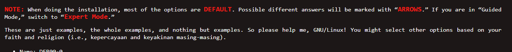

# Doit Conventions

in converting the "old style" to be consistent, let us use the following conventions:

The documents we'll be using are:
* [Debian Guest Preparation - Old `doit`](https://doit.vlsm.org/013.html)
* [Debian Guest Preparation - New `doit`](https://cbk2000.github.io/doit-revamp/docs/virtualbox/debian-guest-preparation)

## Headings
Use *exactly as in the old version*

## Use `admonitions`
[`Adominitions`](https://docusaurus.io/docs/next/markdown-features/admonitions) are "blocks" that we can use to emphasise information. This could be used to show `DANGER` and `NOTE`, for example.

### Old Syle

```html
<span style="color:red; font-weight:bold; font-size:larger;">NOTE:</span>
When doing the installation, most of the options are 
<span style="color:red; font-weight:bold; font-size:larger;">DEFAULT</span>. 
Possible different answers will be marked with 
"<span style="color:red; font-weight:bold; font-size:larger;">ARROWS</span>."
If you are in "Guided Mode," switch to 
"<span style="color:red; font-weight:bold; font-size:larger;">Expert Mode</span>."

These are just examples, the whole examples, and nothing but examples. So please help me, GNU/Linux!
You might select other options based on your faith and religion 
(i.e., kepercayaan and keyakinan masing-masing).

```

### Admonitions
:::note

* When doing the installation, most of the options are **DEFAULT**. Possible different answers will be marked with **`ARROWS`**. 
* If you are in `Guided Mode`, switch to `Expert Mode`.
* These are just examples, the whole examples, and nothing but examples. So please help me, `GNU/Linux`! 
  
You might select other options based on your faith and religion *(i.e., kepercayaan and keyakinan masing-masing).*

:::
```md
:::note

* When doing the installation, most of the options are **DEFAULT**. Possible different answers will be marked with **`ARROWS`**. 
* If you are in `Guided Mode`, switch to `Expert Mode`.
* These are just examples, the whole examples, and nothing but examples. So please help me, `GNU/Linux`! 
  
You might select other options based on your faith and religion *(i.e., kepercayaan and keyakinan masing-masing).*

:::
```

## Preformatting
If something is clickable, selectable, or to be copy and paste, use either
* two backticks ` `` `:

  `sudo rm -ef`
  ```
  `sudo rm -rf`
  ```
* code blocks
  ```
  this is a codeblock!
  ```
  ` ``` `

## Emphasis
If something needs emphasis, use **BOLD** instead of individual styling

## Tables
When showing a lot of parameters, try to use a table to help data

| Field | Param |
|---|---|
| Name | `DEB00-0`|
| Type | `Linux`|
| Version | `Debian (64 bit)` |
| Base Memory | `4096 MB`|
| Processors | `4` |
| Hard Disk |
| > Size | `24 GB`|
| > Type | `VDI`|