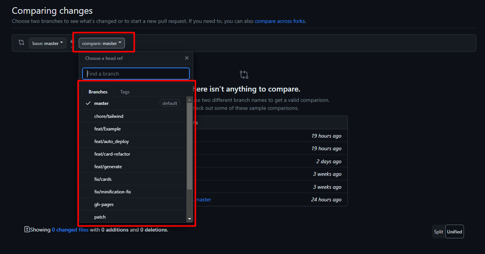
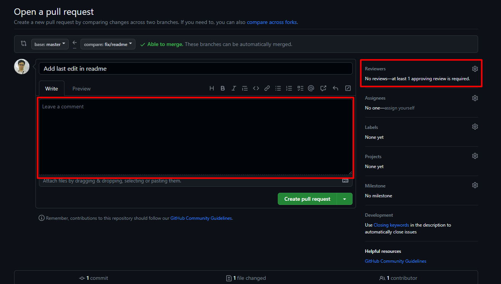

# SOP Merging to Master

Case: Merging changes of adding "SandBox/" directory to [docubase master branch](https://github.com/cbk2000/docubase)

### Open github
[Go to Github](https://github.com/cbk2000/docubase)

### Go to the Pull Request Tab

### Create New Pull Request button

### Search the pushed branch

### Create PR to merge feat/sandbox to master

### Leave a comment for a reviewer and ping a reviewer

#### *Pick a minimum of 1 Reviewer to approve the changes

### Finalize the Pull Request

### Merge Check

#### Wait for reviewer to Approve the changes

##### On Approval should look like this

#### Wait for pipeline for deployment

##### On Success should look like this

### Finalize and Merge
